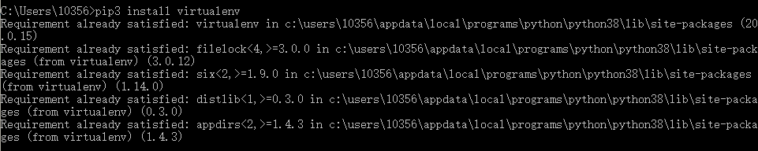
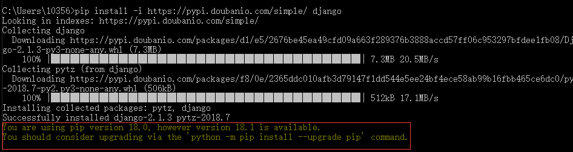
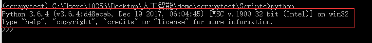

# 虚拟环境

打开cmd：

python2:

```text
 pip install virtualenv
```

python3:

```text
  pip3 install virtualenv
```



## 第三方镜像

### 下载国内镜像，快速下载安装包，避免超时

python豆瓣源，第三方镜像

```text
 https://pypi.doubanio.com/simple/
```

使用案例：

比如-安装selenium,django

```text
 pip install -i https://pypi.doubanio.com/simple/ selenium
 pip install -i https://pypi.doubanio.com/simple/ django
```



解决方案：python -m pip install --upgrade pip

卸载已安装的组件：

```text
  pip uninstall django（组件名）
```

## python3新建虚拟环境

```text
  virtualenv -p D:\python3\python.exe(python的安装路径) scrapypy3
```

安装在了当前目录下。

## 创建虚拟环境

```text
  virtualenv  name(scrapytest)
```

## 开启虚拟环境

```text
  cd scrapytest/Scripts activate.bat
```

```text
执行python:
```



## 退出虚拟环境

```text
  deactivate.bat
```

## virtualenvwrapper

### 安装virtualenvwrapper

```text
pip install virtualenvwrapper-win （中间没有空格virtualenvwrapper-win）
```

### 查看所有的虚拟环境

```text
workon
```


## 基于virtualenvwrapper创建虚拟环境

```text
mkvirtualenv py3scrapy
```

### 修改虚拟环境存放目录

```text
添加环境变量--->WORKON_HOME,不需要添加path
```


### 进入某虚拟环境：

workon name

### 退出虚拟环境：

deactivate

### 查看依赖吧包：

pip list

