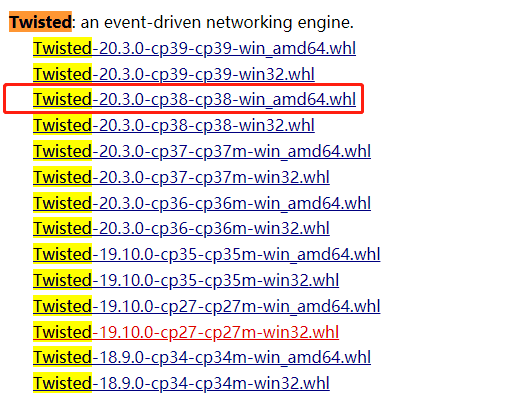
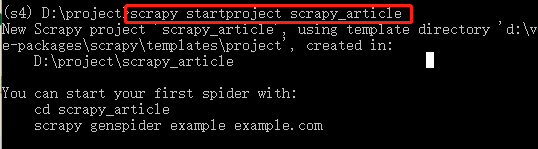
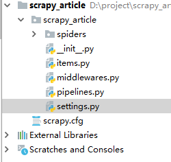
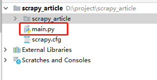
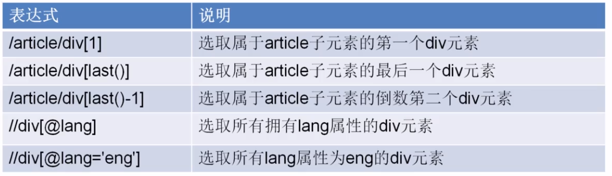
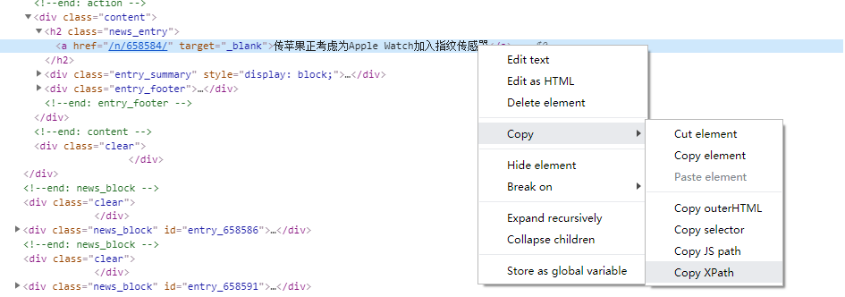
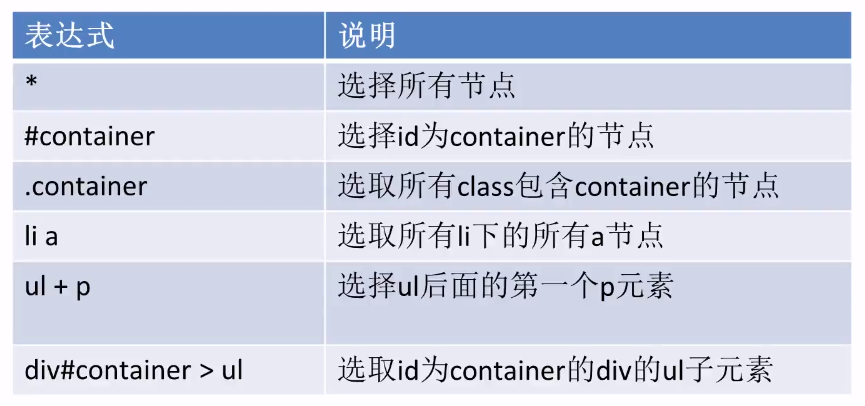
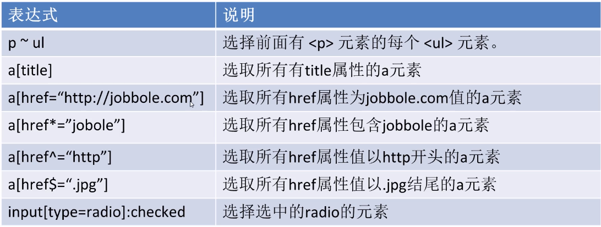
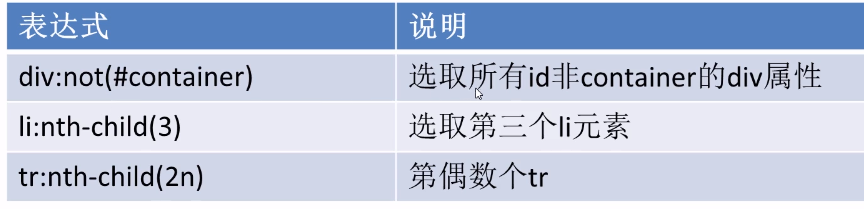

# scrapy入门

## scrapy安装和配置

* 创建虚拟环境

```text
mkvirtualenv scrapytest
```

* 进入虚拟环境scrapytest

```text
 workon scrapytest
```

* 在虚拟环境中安装scrapy

```text
 pip install -i https://pypi.doubanio.com/simple/ scrapy
```

* 报错

```text
 ERROR: Failed building wheel for Twisted
```

解决方案： 打开网站 [https://www.lfd.uci.edu/~gohlke/pythonlibs/](https://www.lfd.uci.edu/~gohlke/pythonlibs/) 搜索Twisted,下载相应版本 \(本机python3.8 64位\)



* 安装Twisted（cmd进入Twisted安装包所在的目录）

```text
pip install Twisted-20.3.0-cp38-cp38-win_amd64.whl
```

* 再次执行scrapy安装

```text
 pip install -i https://pypi.doubanio.com/simple/ scrapy
```

## scrapy构建项目

* 进入虚拟环境，执行命令

```text
scrapy startproject [项目名]
```



* 导入pycharm

  

* 进入项目目录，并执行命令

```text
cd  scrapy_article

scrapy genspider cnblogs https://news.cnblogs.com/
```

> 在spider目录下生成cnblogs.py文件


* 找不到scrapy包，需要配置项目的解释器

  

  **需求分析**

  抓取网站：

  [https://news.cnblogs.com/](https://news.cnblogs.com/)

## 启动爬虫项目

命令行执行爬虫：

```text
 scrapy crawl cnblogs
```

## 使用pycharm调式scrapy

* pycharm没有scrapy的模板，无法调试scrapy,解决方案如下：

  1. step1:创建main.py

     ```python
     from scrapy.cmdline import execute
     import  sys
     import  os
     print(os.path.dirname(os.path.abspath(__file__)))
     sys.path.append(os.path.dirname(os.path.abspath(__file__)))
     execute(["scrapy","crawl","cnblogs"])
     ```

  

* debug运行main.js

  > 进入parse函数，代表着start\_urls已经被下载完成

```text
    def parse(self, response):
        pass
```


> settings.py修改参数

```text
# Obey robots.txt rules
ROBOTSTXT_OBEY = False
```

## xpath

* xpath简介

  xpath使用路径表达式在xml和html中进行导航

  xpath包含标准函数库

  xpath是一个W3C的标准

* xpath节点关系

  1，父节点

  2，子节点

  3，同袍节点

  4，先辈节点

  5，后代节点

* xpath语法   
* 从网页上获取某个元素的xpath路径： 

  **xpath提取元素**

> 命令行下下载指定url网页

```text
scrapy shell  url
```

案例：

```text
  scrapy shell  https://news.cnblogs.com/n/663347/
```

* 提取标题

  ```python
  response.xpath('/html/body/div[2]/div[2]/div[2]/div[1]/a/text()').extract_first()
  or
  response.xpath('/html/body/div[2]/div[2]/div[2]/div[1]/a/text()').extract()[0]
  or
   response.xpath("//div[@id='news_title']/a/text()").extract_first()
  ```

## css选择器







* 提取标题

  ```python
  response.css("div#news_title>a::text").extract_first()
  ```

> 获取属性 response.css\("div\#news\_title&gt;a::attr\(属性名\)"\).extract\_first\(\)

