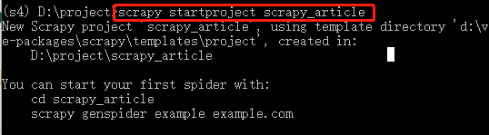
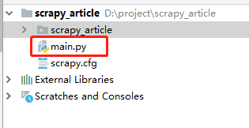
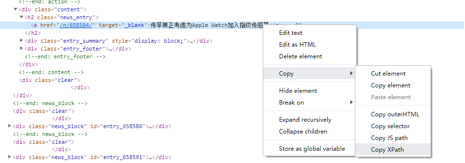
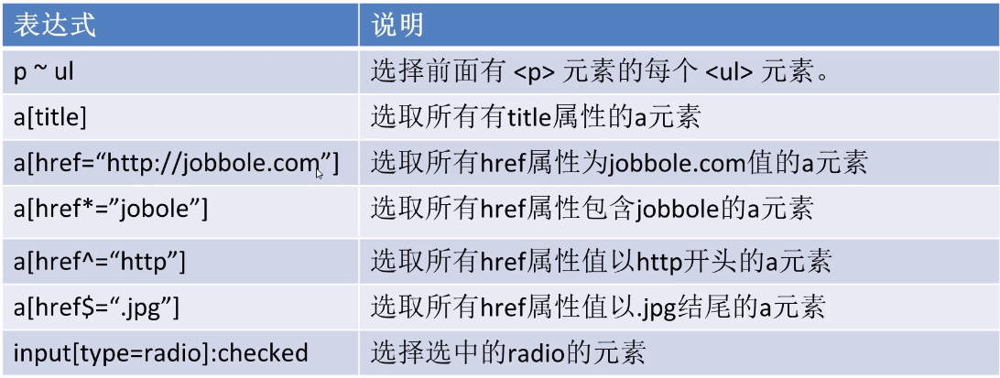

# scrapy爬取知名博客网站数据


## scrapy安装和配置

- 创建虚拟环境

```
mkvirtualenv scrapytest
```

- 进入虚拟环境scrapytest

```
 workon scrapytest
```

- 在虚拟环境中安装scrapy

```
 pip install -i https://pypi.doubanio.com/simple/ scrapy
```

- 报错

```
 ERROR: Failed building wheel for Twisted
```

解决方案： 
打开网站 https://www.lfd.uci.edu/~gohlke/pythonlibs/
搜索Twisted,下载相应版本 (本机python3.8 64位)

  
  
- 安装Twisted（cmd进入Twisted安装包所在的目录）

```
pip install Twisted-20.3.0-cp38-cp38-win_amd64.whl
```

- 再次执行scrapy安装

```
 pip install -i https://pypi.doubanio.com/simple/ scrapy
```


## scrapy构建项目

- 进入虚拟环境，执行命令

```
scrapy startproject [项目名]
```

  


- 导入pycharm

  


- 进入项目目录，并执行命令

```
cd  scrapy_article

scrapy genspider cnblogs https://news.cnblogs.com/

```

> 在spider目录下生成cnblogs.py文件

  
  
- 找不到scrapy包，需要配置项目的解释器

 
  
  ## 需求分析
  
  抓取网站：
  
  https://news.cnblogs.com/
  
## 启动爬虫项目

 命令行执行爬虫：
 ```
 scrapy crawl cnblogs
 ```
  
  ## 使用pycharm调式scrapy
 
- pycharm没有scrapy的模板，无法调试scrapy,解决方案如下：
 
 1.  step1:创建main.py
 ``` python
from scrapy.cmdline import execute
import  sys
import  os
print(os.path.dirname(os.path.abspath(__file__)))
sys.path.append(os.path.dirname(os.path.abspath(__file__)))
execute(["scrapy","crawl","cnblogs"])
 ```
 
 
 
2.  debug运行main.js
> 进入parse函数，代表着start_urls已经被下载完成

```
    def parse(self, response):
        pass
```


> settings.py修改参数

```
# Obey robots.txt rules
ROBOTSTXT_OBEY = False
``` 
  
 ## xpath
  
- xpath简介
  <p>xpath使用路径表达式在xml和html中进行导航</p>
  <p>xpath包含标准函数库</p>
  <p>xpath是一个W3C的标准</p>
- xpath节点关系
  <p>1，父节点</p>
  <p>2，子节点</p>
  <p>3，同袍节点</p>
  <p>4，先辈节点</p>
  <p>5，后代节点</p>
- xpath语法
  
  
  
  
- 从网页上获取某个元素的xpath路径：
  
  
 ## xpath提取元素

>命令行下下载指定url网页

```
scrapy shell  url
```
  
案例：
  
```
  scrapy shell  https://news.cnblogs.com/n/663347/

 ```
 
- 提取标题
 
 ```python
  response.xpath('/html/body/div[2]/div[2]/div[2]/div[1]/a/text()').extract_first()
  or
  response.xpath('/html/body/div[2]/div[2]/div[2]/div[1]/a/text()').extract()[0]
  or
   response.xpath("//div[@id='news_title']/a/text()").extract_first()
 ```
 
  
 ##css选择器
 

   

	 

  
- 提取标题
```python
response.css("div#news_title>a::text").extract_first()
```
  
> 获取属性  response.css("div#news_title>a::attr(属性名)").extract_first()
  
  
  
  
  
  
  
  