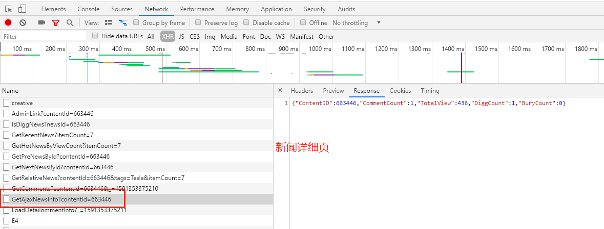
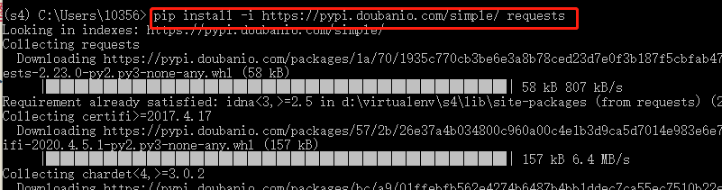
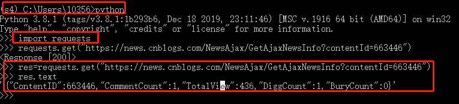
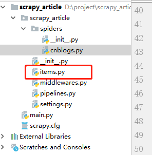
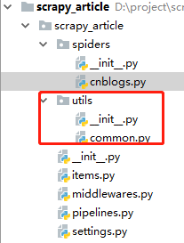

#scrapy爬取知名博客网站数据


- 获取列表项

```python
# -*- coding: utf-8 -*-
import scrapy

class CnblogsSpider(scrapy.Spider):
    name = 'cnblogs'
    allowed_domains = ['https://news.cnblogs.com/']
    start_urls = ['https://news.cnblogs.com/']
    '''
    1. 解析出列表页中的新闻url并交给scrapy进行下载后调用相应的解析方法
    2. 获取下一页的url并交给scrapy进行下载，下载完成后交给parse继续跟进
    '''
    def parse(self, response):
        blocks=response.css("div#news_list .news_block")
        pass
```


> blocks为Selectorlist,Selector本身可以当做选择器使用

- 获取图片&下载详细页

``` python
# -*- coding: utf-8 -*-
import scrapy
from scrapy import  Request
from urllib import parse

class CnblogsSpider(scrapy.Spider):
    name = 'cnblogs'
    allowed_domains = ['https://news.cnblogs.com/']
    start_urls = ['https://news.cnblogs.com/']
    '''
    1. 解析出列表页中的新闻url并交给scrapy进行下载后调用相应的解析方法
    2. 获取下一页的url并交给scrapy进行下载，下载完成后交给parse继续跟进
    '''
    def parse(self, response):
        blocks=response.css("div#news_list .news_block")
        for block in blocks:
            #获取图标
            img_url=block.css(".entry_summary a img::attr(src)").extract_first("无图片")
            #获取详细页url
            detail_url = block.css("h2.news_entry a::attr(href)").extract_first("")
            # 下载详细页数据
            yield  Request(url=parse.urljoin(response.url,detail_url),
                           meta={"front_img_url": img_url},
                           callback=self.parse_detail,dont_filter=True)
```

> Request()参数解释
> 1. url: 要下载的url
> 2. meta: 将img_url作为参数传递给url页面
> 3. callback: url下载完成后，回调callback所定义的方法
> 4. dont_filter: True 去重url

``` python
    def parse_detail(self, response):
        print("==============" + response.url)
```


- 提取下一页并下载

``` python
# 下载详细页数据
            yield  Request(url=parse.urljoin(response.url,detail_url),
                           meta={"front_img_url": img_url},
                           callback=self.parse_detail,dont_filter=True)

        next_text=response.css("div.pager a:last_child::text").extract_first("")
        if next_text =="Next >":
            next_url=response.css("div.pager a:last_child::attr(href)").extract_first("")
            yield Request(url=parse.urljoin(response.url, next_url),
                          callback=self.parse, dont_filter=True)
```

- 代码整合

```python
# -*- coding: utf-8 -*-
import scrapy
from scrapy import  Request
from urllib import parse

class CnblogsSpider(scrapy.Spider):
    name = 'cnblogs'
    allowed_domains = ['https://news.cnblogs.com/']
    start_urls = ['https://news.cnblogs.com/']

    '''
    1. 解析出列表页中的新闻url并交给scrapy进行下载后调用相应的解析方法
    2. 获取下一页的url并交给scrapy进行下载，下载完成后交给parse继续跟进
    '''

    def parse(self, response):
        blocks=response.css("div#news_list .news_block")
        for block in blocks:
            #获取图标
            img_url=block.css(".entry_summary a img::attr(src)").extract_first("无图片")
            #获取详细页url
            detail_url = block.css("h2.news_entry a::attr(href)").extract_first("")
            # 下载详细页数据
            yield  Request(url=parse.urljoin(response.url,detail_url),
                           meta={"front_img_url": img_url},
                           callback=self.parse_detail,dont_filter=True)

        next_text=response.css("div.pager a:last_child::text").extract_first("")
        if next_text =="Next >":
            next_url=response.css("div.pager a:last_child::attr(href)").extract_first("")
            yield Request(url=parse.urljoin(response.url, next_url),
                          callback=self.parse, dont_filter=True)


    def parse_detail(self, response):
        print("==============" + response.url)
```


## 提取详细页信息

- 提取标题、创建时间、内容、标签

```python
 def parse_detail(self, response):
        print("==============" + response.url)
        title=response.css("div#news_title a::text").extract_first("")
        create_time=response.css("div#news_info .time::text").extract_first("")
		提取年月日时分秒
		 date_match = re.match(".*?(\d+.*)", create_time)
            if date_match:
                create_time=date_match.group(1)
        content= response.css("div#news_body").extract_first("")
        tags=",".join(response.css("div.news_tags a::text").extract())
```

- 提取评论数、阅读数、点赞数

<p style="color:red"> 这些数据异步加载，在原始html网页上并没有这些数据，需要模拟请求 </p>



1. 进入虚拟环境，安装requests库，模拟网络请求


2. 进入python环境，使用requests

3. 将json字符串转对象


```python
   #评论数、阅读数、点赞数 都获取不到，因为是异步加载
        import requests
        import re
        import json
        match_obj=re.match(".*?(\d+).*",response.url)
        if match_obj:
            contentid=match_obj.group(1)
            res=requests.get(parse.urljoin(response.url,"/NewsAjax/GetAjaxNewsInfo?contentId={}".format(contentid)))
            obj=json.loads(res.text)
            comment_count=obj['CommentCount'] # 评论数
            praise_count=obj['DiggCount'] #点赞数
            view_count=obj['TotalView'] # 阅读数
```


<p style="color:red;">改成异步请求</p>

```python
 def parse_detail(self, response):
        print("==============" + response.url)

        #评论数、阅读数、点赞数 都获取不到，因为是异步加载
        import requests
        import re
        import json
        match_obj=re.match(".*?(\d+).*",response.url)
        if match_obj:
            contentid=match_obj.group(1)
            title = response.css("div#news_title a::text").extract_first("")
            create_time = response.css("div#news_info .time::text").extract_first("")
            content = response.css("div#news_body").extract_first("")
            tags = ",".join(response.css("div.news_tags a::text").extract())
            yield Request(url=parse.urljoin(response.url,"/NewsAjax/GetAjaxNewsInfo?contentId={}".format(contentid)),callback=self.data_parse,dont_filter=True)

    def data_parse(self,res):
        import json
        obj = json.loads(res.text)
        comment_count = obj['CommentCount']  # 评论数
        praise_count = obj['DiggCount']  # 点赞数
        view_count = obj['TotalView']  # 阅读数
```

> 注意： 上面的代码中，因为获取点赞、评论等是异步加载，因此需要将文字标题、内容等数据传递给data_parse函数。

## items的定义和使用

### 数据传递
- 在items.py自定义Item




- 自定义CnblogArticleItem

```python
 # -*- coding: utf-8 -*-

# Define here the models for your scraped items
#
# See documentation in:
# https://docs.scrapy.org/en/latest/topics/items.html

import scrapy


class ScrapyArticleItem(scrapy.Item):
    # define the fields for your item here like:
    # name = scrapy.Field()
    pass


class CnblogArticleItem(scrapy.Item):
    title = scrapy.Field()
    content=scrapy.Field()
    tags = scrapy.Field()
    create_date = scrapy.Field()
    url = scrapy.Field()
    url_object_id = scrapy.Field()
    front_image_url = scrapy.Field()
    front_image_path = scrapy.Field()
    praise_nums = scrapy.Field()
    comment_nums = scrapy.Field()
    fav_nums = scrapy.Field()
    tags_nums = scrapy.Field()
    content_nums = scrapy.Field()
```

- 使用CnblogArticleItem作为参数传给下一个回调方法

```python
 def parse_detail(self, response):
        print("==============" + response.url)

        #评论数、阅读数、点赞数 都获取不到，因为是异步加载
        import requests
        import re
        import json
        match_obj=re.match(".*?(\d+).*",response.url)
        if match_obj:
            contentid=match_obj.group(1)
            title = response.css("div#news_title a::text").extract_first("")
            create_time = response.css("div#news_info .time::text").extract_first("")
            content = response.css("div#news_body").extract_first("")
            tags = ",".join(response.css("div.news_tags a::text").extract())
            from scrapy_article.items import  CnblogArticleItem
			#使用CnblogArticleItem
            article_item = CnblogArticleItem()
            article_item["title"] = title
            article_item["create_date"] = create_time
            article_item["content"] = content
            article_item["tags"] = tags
            article_item["front_image_url"] = response.meta.get("front_img_url","")
            article_item["url"] = response.url
            yield Request(url=parse.urljoin(response.url,"/NewsAjax/GetAjaxNewsInfo?contentId={}".format(contentid)),
                          callback=self.data_parse,
                          meta={"article_item":article_item},
                          dont_filter=True)

```

- 在回调方法中获取CnblogArticleItem

```python
    def data_parse(self,res):
        import json
        obj = json.loads(res.text)
        comment_count = obj['CommentCount']  # 评论数
        praise_count = obj['DiggCount']  # 点赞数
        view_count = obj['TotalView']  # 阅读数

        article_item=res.meta.get("article_item")
        article_item['praise_nums'] = praise_count
        article_item['comment_nums'] = comment_count
        article_item['fav_nums'] = view_count
```

- url经过md5后作为主键


<p>创建common.py</p>



```python
 import hashlib

def get_md5(url):
    if isinstance(url,str):
        url=url.encode("utf-8")

    m=hashlib.md5()
    m.update(url)

    return m.hexdigest()
```

- url经过md5加密


```
 from scrapy_article.utils import common
article_item['url_object_id']=common.get_md5(article_item['url'])
```

- yield 进入pipeline

```
 yield article_item
```

> 提醒： yield 一个Item就会进入pipeline

- 需要配置pipeline

<p>打开settings.py</p>

```
# Obey robots.txt rules
ROBOTSTXT_OBEY = False

#打开pipeline注释

ITEM_PIPELINES = {
   'scrapy_article.pipelines.ScrapyArticlePipeline': 300,
}

```


<p>完整代码</p>

```python
# -*- coding: utf-8 -*-
import scrapy
from scrapy import  Request
from urllib import parse


class CnblogsSpider(scrapy.Spider):
    name = 'cnblogs'
    allowed_domains = ['https://news.cnblogs.com/']
    start_urls = ['https://news.cnblogs.com/']

    '''
    1. 解析出列表页中的新闻url并交给scrapy进行下载后调用相应的解析方法
    2. 获取下一页的url并交给scrapy进行下载，下载完成后交给parse继续跟进
    '''

    def parse(self, response):
        blocks=response.css("div#news_list .news_block")[:1]
        for block in blocks:
            #获取图标
            img_url=block.css(".entry_summary a img::attr(src)").extract_first("无图片")
            #获取详细页url
            detail_url = block.css("h2.news_entry a::attr(href)").extract_first("")
            # 下载详细页数据
            yield  Request(url=parse.urljoin(response.url,detail_url),
                           meta={"front_img_url": img_url},
                           callback=self.parse_detail,dont_filter=True)

        next_text=response.css("div.pager a:last_child::text").extract_first("")
        if next_text =="Next >":
            next_url=response.css("div.pager a:last_child::attr(href)").extract_first("")
            yield Request(url=parse.urljoin(response.url, next_url),
                          callback=self.parse, dont_filter=True)


    def parse_detail(self, response):
        print("==============" + response.url)

        #评论数、阅读数、点赞数 都获取不到，因为是异步加载
        import requests
        import re
        import json
        match_obj=re.match(".*?(\d+).*",response.url)
        if match_obj:
            contentid=match_obj.group(1)
            title = response.css("div#news_title a::text").extract_first("")
            create_time = response.css("div#news_info .time::text").extract_first("")
			提取年月日时分秒
			 date_match = re.match(".*?(\d+.*)", create_time)
			    if date_match:
			        create_time=date_match.group(1)
            content = response.css("div#news_body").extract_first("")
            tags = ",".join(response.css("div.news_tags a::text").extract())
            from scrapy_article.items import  CnblogArticleItem
            article_item = CnblogArticleItem()
            article_item["title"] = title
            article_item["create_date"] = create_time
            article_item["content"] = content
            article_item["tags"] = tags
            article_item["front_image_url"] = response.meta.get("front_img_url","")
            article_item["url"] = response.url
            yield Request(url=parse.urljoin(response.url,"/NewsAjax/GetAjaxNewsInfo?contentId={}".format(contentid)),
                          callback=self.data_parse,
                          meta={"article_item":article_item},
                          dont_filter=True)

    def data_parse(self,res):
        import json
        obj = json.loads(res.text)
        comment_count = obj['CommentCount']  # 评论数
        praise_count = obj['DiggCount']  # 点赞数
        view_count = obj['TotalView']  # 阅读数

        article_item=res.meta.get("article_item")
        article_item['praise_nums'] = praise_count
        article_item['comment_nums'] = comment_count
        article_item['fav_nums'] = view_count
        from scrapy_article.utils import common
        article_item['url_object_id']=common.get_md5(article_item['url'])

        # yield Item会进入到pipeline
        yield article_item


```


## scrapy配置图片下载

### 一、配置五步骤

- step1 settings.py添加图片下载pipeline
``` python
ITEM_PIPELINES = {
   'scrapy_article.pipelines.ScrapyArticlePipeline': 300,
   'scrapy.pipelines.images.ImagesPipeline': 1
}
```

- step2 在settings.py中设置图片保存路径IMAGE_STORE

```python
import os
IMAGES_STORE = os.path.join(os.path.dirname(os.path.abspath(__file__)),"images")
```

> 需要创建images目录

- step3 settings.py中设置要下载的url
```
IMAGES_URLS_FIELD = 'front_image_url'
```
> url来源于item中图片url字段
- step4  ModuleNotFoundError: No module named 'PIL'

>缺少图片处理库
```python
pip install pillow
```


- step5  bug
```
 raise ValueError('Missing scheme in request url: %s' % self._url) 
 ValueError: Missing scheme in request url: h
```

>解决方案： 给item的图片url赋值应该是集合类型

```python
article_item["front_image_url"] = [response.meta.get("front_img_url","")]
```


### 二、图片下载完成，保存图片下载路径等相关信息

- 自定义pipeline

```python
from scrapy.pipelines.images import ImagesPipeline
class ArticleImagePipeline(ImagesPipeline):
    def item_completed(self,results,item,info):
        if "front_image_url" in item:
            for ok,value in results:
                image_file_path=value["path"]

            item["front_image_path"]=image_file_path

        return item
```
> 一定要return item

- settings.py中配置自定义的pipeline

```python
ITEM_PIPELINES = {
   'scrapy_article.pipelines.ScrapyArticlePipeline': 300,
   #'scrapy.pipelines.images.ImagesPipeline': 1
   'scrapy_article.pipelines.ArticleImagePipeline': 1
}
```

## item数据写入到json文件

#### 将数据保存到本地文件中

- 定义保存数据的pipeline

```python
import codecs
import json

class JsonWithEncodingPipeline(object):
    #自定义json文件的导出
    def __init__(self):
        self.file=codecs.open("article.json","a",encoding="utf-8")
    方法名称固定，不能自定义
    def process_item(self,item,spider):

        lines=json.dumps(dict(item),ensure_ascii=False)+"\n"
        self.file.write(lines)
        return item
    方法名称固定，不能自定义
    def spider_closed(self,spider):
        self.file.close()


```

- 配置setting.py

```
settings.py
ITEM_PIPELINES = {
    #数字越小，优先级越高
	scrapy_article.pipelines.ScrapyArticlePipeline': 300,
   'scrapy_article.pipelines.ArticleImagePipeline': 1,
   'scrapy_article.pipelines.JsonWithEncodingPipeline': 2
}
```


#### 方式二：将数据保存到json文件中

```python
from scrapy.exporters import JsonItemExporter

class JsonExporterPipeline(object):
    自定义json文件的导出
    def __init__(self):
        self.file=codecs.open("articleexport.json","wb")
        self.exporter=JsonItemExporter(self.file,encoding="utf-8",ensure_ascii=False)
        self.exporter.start_exporting()
    方法名称固定，不能自定义
    def process_item(self,item,spider):

        self.exporter.export_item(item)
        return item
		
    def spider_closed(self,spider):
        self.exporter.finish_exporting()
        self.file.close()

```


## pipeline数据库保存

- 创建库

```
create database article_spider if not exists ;
```

- 建表 jobbole_article

```sql
create database article_spider if not exists ;
use article_spider;
drop table if exists jobbole_article;
create table jobbole_article(
  url_object_id varchar(50) primary key ,
  title varchar(255) ,
  url varchar(500),
  front_image_path varchar(200) ,
  front_image_url varchar(500),
  parise_nums int(255),
  comment_nums int(255),
  fav_nums int(255),
  tags varchar(255),
  content longtext,
  create_date datetime
);
```

- 加载数据库驱动

```
pip3 install  mysqlclient-1.4.6-cp38-cp38-win_amd64.whl
```

- 自定义MysqlPipeline

```python
class MysqlPipeline(object):
    def __init__(self):
        #MySQLdb同步库
        self.conn=MySQLdb.connect("127.0.0.1","root","root","article_spider",charset="utf8",use_unicode=True)
        self.cursor=self.conn.cursor()

    def process_item(self, item, spider):

        insert_sql="""
        insert into jobbole_article(title ,url , url_object_id ,front_image_path ,front_image_url,parise_nums,comment_nums , 
        fav_nums,tags,content ,create_date )
         values(%s,%s,%s,%s,%s,%s,%s,%s,%s,%s,%s)   
        """
        params=list()
        params.append(item.get("title",""))
        params.append(item.get("url",""))
        params.append(item.get("url_object_id",""))
        params.append(item.get("front_image_path",""))
        front_image=".".join(item.get("front_image_url", []))
        params.append(front_image)
        params.append(item.get("parise_nums",0))
        params.append(item.get("comment_nums",0))
        params.append(item.get("fav_nums",0))
        params.append(item.get("tags",""))
        params.append(item.get("content",""))
        params.append(item.get("create_date",""))

        self.cursor.execute(insert_sql,tuple(params))
        self.conn.commit()
        return item
```


- 配置mysql参数

>settings.py

```
MYSQL_HOST="localhost"
MYSQL_DBNAME="article_spider"
MYSQL_USER="root"
MYSQL_PASSWD="root"
```

- 注册MysqlPipeline

```
ITEM_PIPELINES = {
   'scrapy_article.pipelines.ScrapyArticlePipeline': 300,
   #'scrapy.pipelines.images.ImagesPipeline': 1
   'scrapy_article.pipelines.ArticleImagePipeline': 1,
   'scrapy_article.pipelines.JsonWithEncodingPipeline': 2,
   'scrapy_article.pipelines.JsonExporterPipeline': 3,
   'scrapy_article.pipelines.MysqlPipeline': 4
}
```

## 异步入库mysql

- 自定义pipeline

```python

class MysqlTwistedPipeline(object):

    def __init__(self,dbpool):
        self.dbpool=dbpool

    #方法名固定
    @classmethod
    def from_settings(cls,settings):
        from MySQLdb.cursors import DictCursor
        dbparams=dict(
            host=settings["MYSQL_HOST"],
            db=settings["MYSQL_DBNAME"],
            user=settings["MYSQL_USER"],
            passwd=settings["MYSQL_PASSWD"],
            charset="utf8",
            cursorclass=DictCursor,
            use_unicode=True,
        )
		from twisted.enterprise import adbapi
        dbpool=adbapi.ConnectionPool("MySQLdb",**dbparams)
        return cls(dbpool)

    def process_item(self,item,spider):
        query=self.dbpool.runInteraction(self.do_insert,item)
        query.addErrback(self.handle_error,item,spider)
    # 自定义
    def do_insert(self,cursor,item):

        insert_sql,params=item.get_insert_sql()
        cursor.execute(insert_sql, tuple(params))

    # 自定义
    def handle_error(self,failure,item,spider):
        print(failure)
        pass
```

- 注册pipeline

```python
ITEM_PIPELINES = {
   'scrapy_article.pipelines.ScrapyArticlePipeline': 300,
   #'scrapy.pipelines.images.ImagesPipeline': 1
   'scrapy_article.pipelines.ArticleImagePipeline': 1,
   'scrapy_article.pipelines.JsonWithEncodingPipeline': 2,
   'scrapy_article.pipelines.JsonExporterPipeline': 3,
   #'scrapy_article.pipelines.MysqlPipeline': 4
   'scrapy_article.pipelines.MysqlTwistedPipeline': 4

}
```
			
- 在item.py中封装get_insert_sql方法

```python
class CnblogArticleItem(scrapy.Item):
    title = scrapy.Field()
    content=scrapy.Field()
    tags = scrapy.Field()
    create_date = scrapy.Field()
    url = scrapy.Field()
    url_object_id = scrapy.Field()
    front_image_url = scrapy.Field()
    front_image_path = scrapy.Field()
    praise_nums = scrapy.Field()
    comment_nums = scrapy.Field()
    fav_nums = scrapy.Field()
    tags_nums = scrapy.Field()
    content_nums = scrapy.Field()

    def get_insert_sql(self):
        insert_sql = """
                        insert into jobbole_article(title ,url , url_object_id ,front_image_path ,front_image_url,parise_nums,comment_nums , 
                        fav_nums,tags,content ,create_date )
                         values(%s,%s,%s,%s,%s,%s,%s,%s,%s,%s,%s)  on duplicate key update parise_nums=values(parise_nums)
                        """
        params = list()
        params.append(self.get("title", ""))
        params.append(self.get("url", ""))
        params.append(self.get("url_object_id", ""))
        params.append(self.get("front_image_path", ""))
        front_image = ".".join(self.get("front_image_url", []))
        params.append(front_image)
        params.append(self.get("parise_nums", 0))
        params.append(self.get("comment_nums", 0))
        params.append(self.get("fav_nums", 0))
        params.append(self.get("tags", ""))
        params.append(self.get("content", ""))
        params.append(self.get("create_date", ""))
        return insert_sql, params
```