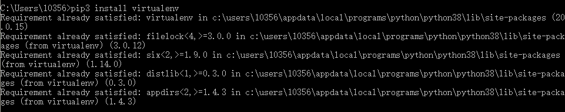

## 安装虚拟环境

打开cmd：

python2:
```
 pip install virtualenv
```
  python3:   
  ```
  pip3 install virtualenv
  ```
  
  
###  第三方镜像
 
 #### 下载国内镜像，快速下载安装包，避免超时
 
 python豆瓣源，第三方镜像
 
 ```
 https://pypi.doubanio.com/simple/
 ```
 使用案例：
 
 比如-安装selenium,django
 
 ```
 pip install -i https://pypi.doubanio.com/simple/ selenium
 pip install -i https://pypi.doubanio.com/simple/ django
 ```
   
  
  解决方案：python -m pip install --upgrade pip
  
  卸载已安装的组件：
  ```
  pip uninstall django（组件名）
  ```
  ### python3新建虚拟环境
  ```
  virtualenv -p D:\python3\python.exe(python的安装路径) scrapypy3
  ```
  安装在了当前目录下。
  
  ### 创建虚拟环境
  ```
  virtualenv  name(scrapytest)
  ```
  
  ### 开启虚拟环境
  
  ```
  cd scrapytest/Scripts activate.bat
  ```
    执行python:
	
  
  
  ### 退出虚拟环境
	
  ```
  deactivate.bat
  ```
	
	
### virtualenvwrapper

#### 安装virtualenvwrapper
```
pip install virtualenvwrapper-win （中间没有空格virtualenvwrapper-win）	
```
#### 查看所有的虚拟环境
```
workon	
```
  


### 基于virtualenvwrapper创建虚拟环境
```
mkvirtualenv py3scrapy
```
#### 修改虚拟环境存放目录

```
添加环境变量--->WORKON_HOME,不需要添加path
```


#### 进入某虚拟环境：
workon name
#### 退出虚拟环境：
deactivate

#### 查看依赖吧包： 

pip list